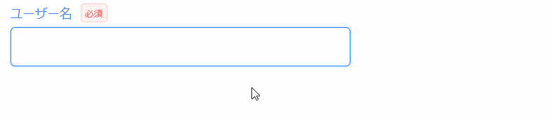

Item を初期化するために使用する `useCsXxxItem` の第三引数に、バリデーションルールを設定できます。

```tsx
useCsXxxItem(..., ..., バリデーションルール, ...);
```

## 標準ルールを使ってバリデーションを定義する

バリデーションルールを設定する際は、省力化コンポーネントが提供するバリデーションルールメソッドを使用します。  
以下の表に示すように、入力項目の値の種類に応じた 5 つのバリデーションルールメソッドを使用できます。

| ルールメソッド    | 対象項目                       | 例                                     |
| ----------------- | ------------------------------ | -------------------------------------- |
| `stringRule`      | 値を文字列で管理する項目       | テキスト入力ボックス、セレクトボックス |
| `numberRule`      | 値を数値で管理する項目         | 数値入力ボックス                       |
| `stringArrayRule` | 値を文字列の配列で管理する項目 | チェックボックス（複数選択）           |
| `numberArrayRule` | 値を数値の配列で管理する項目   | チェックボックス（複数選択）           |
| `booleanRule`     | 値を真偽値で管理する項目       | チェックボックス （単一選択）          |

バリデーションルールメソッドの基本的なシグネチャは以下の通りです。（※詳細については[リファレンス](../../category/リファレンス)を参照してください。）

```tsx
xxxRule(必須指定, 最小値*¹, 最大値*¹, カスタムバリデーションルール*²)

※1 最小値と最大値は stringRule と numberRule のみ設定可能です
※2 カスタムバリデーションルールについては次項で解説します
```

[1.画面を定義する](./define-screen.md)で定義した入力項目に対して設定されているバリデーションルールは以下の表の通りです。

```tsx title="画面項目定義"
const useRegisterUserView = (): RegisterUserView => {
  return useCsView({
    userName: useCsInputTextItem(
      "ユーザー名",
      useInit(""),
      // highlight-next-line
      stringRule(true, 3, 30),
    ),
    password: useCsInputPasswordItem(
      "パスワード",
      useInit(""),
      // highlight-next-line
      stringRule(true, 8, 16),
    ),
    gender: useCsRadioBoxItem(
      "性別",
      useInit(""),
      // highlight-next-line
      stringRule(true),
      selectOptionStrings(["男性", "女性", "回答しない"]),
    ),
    birthDay: useCsInputDateItem(
      "生年月日",
      useInit("2000-01-01"),
      // highlight-next-line
      stringRule(true),
    ),
    terminalNum: useCsInputNumberItem(
      "利用端末数",
      useInit(),
      // highlight-next-line
      numberRule(false, 1, 10),
    ),
  });
};
```

| 項目名     | バリデーションルール                    |
| ---------- | --------------------------------------- |
| ユーザー名 | 入力必須、3 文字以上 30 文字以下        |
| パスワード | 入力必須、8 文字以上 16 文字以下        |
| 性別       | 入力必須                                |
| 生年月日   | 入力必須                                |
| 利用端末数 | 入力任意、入力する場合は 1 以上 10 以下 |

## カスタムルールを使ってバリデーションを定義する

標準のバリデーションルールに加えて、独自のカスタムバリデーションルールを定義もしくは使用できます。これにより、特定のビジネスロジックや要件に応じた柔軟なバリデーションを実現できます。

:::info
新しくカスタムバリデーションルールを作る方法については、[カスタムバリデーションの追加方法](../tips//add-custom-validation.md)を参照してください。  
ここでは、既に作成済みのカスタムバリデーションルールを使用する方法についてのみ解説します。
:::

省力化コンポーネントでは、使用頻度の高いカスタムバリデーションルールを `buildInCustomValidationRules` として提供しています。カスタムバリデーションルールの一覧は[buildInCustomValidationRules](https://github.com/Fintan-contents/dev-react-cs-example/blob/develop/src/framework/validation-rules/buildInCustomValidationRules.ts)ファイルを参照してください。

カスタムバリデーションルールを使用するためには、`useCsView` の第二引数にカスタムバリデーションルールオブジェクトを指定する必要があります。

```tsx title="カスタムバリデーションルールを指定する"
import { buildInCustomValidationRules } from "@/framework/validation-rules";

const useRegisterUserView = (): RegisterUserView => {
  return useCsView(
    {
      userName: useCsInputTextItem(
        "ユーザー名",
        useInit(""),
        stringRule(true, 3, 30),
      ),
      // (...他の画面項目定義...)
    },
    // highlight-start
    {
      customValidationRules: buildInCustomValidationRules,
    },
    // highlight-end
  );
};
```

カスタムバリデーションルールオブジェクトは、以下のようにルール名（キー）とルールメソッド（バリュー）のセットで定義されます。

```tsx title="提供済みbuildInCustomValidationRulesの内容"
export const buildInCustomValidationRules = {
  半角数字: stringCustomValidationRule(
    createRegExpValidator(/^\d*$/),
    (label: string) => `${label}は半角数字で入力してください`,
  ),
  半角英字: stringCustomValidationRule(
    createRegExpValidator(/^[a-zA-Z]*$/),
    (label: string) => `${label}は半角英字で入力してください`,
  ),
  半角英数字: stringCustomValidationRule(
    createRegExpValidator(/^[a-zA-Z0-9]*$/),
    (label: string) => `${label}は半角英数字で入力してください`,
  ),
  // (...省略...)
};
```

カスタムバリデーションルールを使用する場合は、使用したいルールのルール名（キー）を、`useCsXxxItem` の中で使用しているバリデーションルールメソッドの第四引数に指定してください。

```tsx title="カスタムバリデーションルールのキーを指定する"
const useRegisterUserView = (): RegisterUserView => {
  return useCsView(
    {
      userName: useCsInputTextItem(
        "ユーザー名",
        useInit(""),
        // highlight-next-line
        stringRule(true, 3, 30, "半角英数字"),
      ),
      // (...他の画面項目定義...)
    },
    {
      customValidationRules: buildInCustomValidationRules,
    },
  );
};
```

:::note

## バリデーションの実行順序

バリデーションは以下の順序で実施されます。なお、バリデーションエラーが発生したタイミングで、以降のチェックは実施されません。  
例えば、必須チェックエラーとなった場合には、以降のカスタムバリデーション、桁数バリデーションは行われません。

| 実行順 | チェック種類           | チェック内容                   |
| ------ | ---------------------- | ------------------------------ |
| 1      | 必須                   | 項目の有無                     |
| 2      | カスタムバリデーション | 文字種や形式など               |
| 3      | 桁数                   | 項目の長さ ※配列の場合は要素数 |

例として、 `stringRule(true, 3, 30, "半角英数字")` のルールが設定された項目のバリデーション順序を以下に示します。  
上記の表の順序に従い、桁数チェックよりも先に文字種チェックが行われます。



:::
