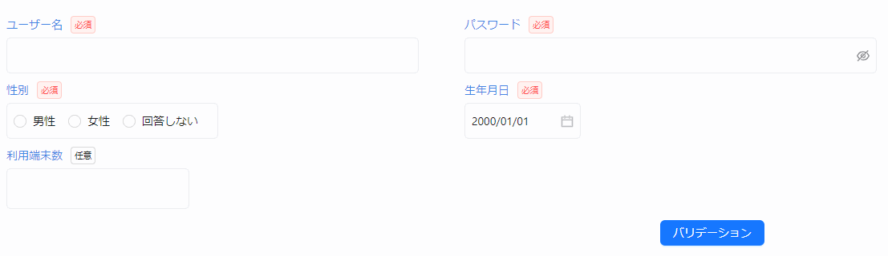

バリデーションを実施する方法として以下の 2 つがあります。

- ボタン押下時にバリデーションを実施する
- 入力フォームのフォーカスアウト時にバリデーションを自動で実施する

※上記の 2 つは併用できます。

### ボタン押下時にバリデーションを実施する

省力化コンポーネントが提供するボタン部品を使用することで、ボタン押下時にバリデーションを実施できます。
`validationViews` という Props に、バリデーション対象の View の変数を配列として指定します。

```tsx title="ボタン押下でバリデーションを実施する"
// 対象画面の View を初期化する
const view = useRegisterUserView();

return (
  <>
    <AxTableLayout view={view} colSize={2} />
    {/* highlight-start */}
    <AxButton
      type="primary"
      validationViews={[view]}
      onClick={() => {}} // onClickは必須プロパティのため指定
    >
      バリデーション
    </AxButton>
    {/* highlight-end */}
  </>
);
```



:::info
`validationViews` には、複数の View 変数を指定することができます。

```tsx
<AxButton type="primary" validationViews={[view1, view2]}>
  バリデーション実行
</AxButton>
```

:::

### 入力フォームのフォーカスアウト時にバリデーションを自動で実施する

`useCsView` の第二引数に `validationTrigger: "onBlur"` を指定することで、各入力フォームのフォーカスが外れたタイミングでバリデーションを実施できます。

```tsx
const useRegisterUserView = (): RegisterUserView => {
  return useCsView(
    {
      userName: useCsInputTextItem(
        "ユーザー名",
        useInit(""),
        stringRule(true, 3, 30),
      ),
      // (...他の画面項目定義...)
    },
    // highlight-start
    {
      validationTrigger: "onBlur",
    },
    // highlight-end
  );
};
```


