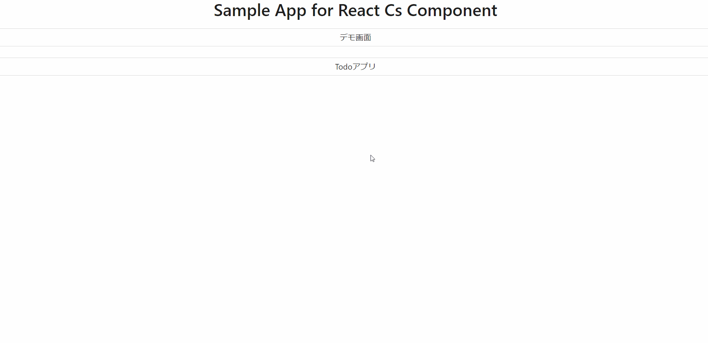

本節では以下に示すような取得機能の実装方法について説明します。



## イベントの型を定義する

取得機能のイベントの型定義には`CsQueryLoadEvent`を指定します。取得用の View（`TodoListView`）のプロパティにイベントの型を定義します。型パラメータには 取得 API のレスポンスの型を定義します。

```ts title="src/app/todo/page.view.ts"
// Orvalで自動生成されたListTodoResponseの型定義をimport

/**
 * 一覧取得用のView
 */
export type TodoListView = CsView & {
  // highlight-start
  loadTodo: CsQueryLoadEvent<ListTodoResponse>; // レスポンスの型を定義
  // highlight-end
};
```

## イベントを初期化する

取得用の View（`TodoListView`）にイベントの初期化処理を追加します。取得 API では Event のフックに`useCsRqAdvancedQueryLoadEvent`、引数には Orval で自動生成された API フック`useListTodo()`を指定します。

```ts title="src/app/todo/page.view.ts"
// Orvalで自動生成されたAPIフック（useListTodo）をimport

/**
 * 一覧取得用のViewの初期化
 *
 * @returns TodoListView 一覧取得用のView
 */
export const useTodoListView = (): TodoListView => {
  return useCsView({
    // highlight-start
    // イベントの初期化処理の追加
    loadTodo: useCsRqAdvancedQueryLoadEvent(useListTodo()),
    // highlight-end
  });
};
```

## View 定義を呼び出す

[イベントを初期化する](./acquisition-feature.md#イベントを初期化する)で定義した 取得用の View 定義を呼び出します。

```tsx title="src/app/todo/page.tsx"
const todoListView = useTodoListView(); // 取得用のViewの呼び出し
```

## 値を取得する

イベントの`response`メソッドを使用して、取得した値を変数(`todoList`)に格納します。
取得した値を画面表示する際などは、こちらの変数（`todoList`）を使用します。

```tsx title="src/app/todo/page.tsx"
const todoList = todoListView.loadTodo.response ?? [];
```

## 値を再取得する

登録、更新や削除などを行った後、値を再取得する場合はイベントの`reload`メソッドを使用します。

```tsx title="src/app/todo/page.tsx"
<TodoEditModal
  record={record}
  isOpenEditModal={isOpenEdit}
  setIsOpenEditModal={() => setIsOpenEdit(false)}
  setIsFilter={() => setIsFilter(false)}
  resetSearchInputArea={() => todoSearchView.assignee.setValue("")}
  // highlight-start
  reload={() => todoListView.loadTodo.reload()}
  // highlight-end
/>
```

以上で、取得機能の実装が完了します。初期表示時に取得 API が呼び出されているか確認してください。
