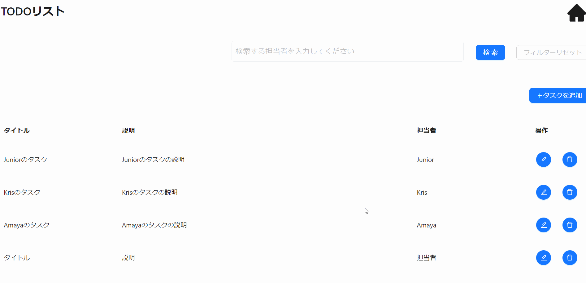

本節では以下に示すような削除機能の実装方法について説明します。



## イベントの型を定義する

削除機能のイベントの型定義には`CsMutateButtonClickEvent`を指定します。

削除用の View（`TodoDeleteView`）のプロパティにイベントの型を定義します。型パラメータには削除 API のリクエスト、レスポンスの型を指定します。

```ts title="src/app/todo/page.view.ts"
// Orvalで自動生成されたTodoの型定義をimport

/**
 * 削除用のView
 */
export type TodoDeleteView = CsView & {
  // 削除対象を識別するためのID（表示はしない）
  id: CsInputTextItem;
  // highlight-start
  deleteButton: CsMutateButtonClickEvent<
    // APIのリクエストデータ型を定義
    {
      todoId: string;
    },
    Todo //APIのレスポンスデータ型を定義
  >;
  // highlight-end
};
```

## イベントを初期化する

削除用の View（`TodoDeleteView`）にイベントの初期化処理を追加します。

削除 API では Event のフックに`useCsRqAdvancedMutateButtonClickEvent()`、引数には Orval で自動生成された API フック`useDeleteTodo()`を指定します。

```ts title="src/app/todo/page.view.ts"
// Orvalで自動生成されたAPIフック（useDeleteTodo）をimport

/**
 * 削除用のViewの初期化
 *
 * @returns TodoDeleteView 削除用のView
 */
export const useTodoDeleteView = (): TodoDeleteView => {
  return useCsView({
    id: useCsInputTextItem("ID", useInit(""), stringRule(false)),
    // highlight-start
    deleteButton: useCsRqAdvancedMutateButtonClickEvent(useDeleteTodo()), // イベントの初期化処理の追加
    // highlight-end
  });
};
```

## View 定義を呼び出す

[イベントを初期化する](./delete-feature.md#イベントを初期化する)で定義した、削除用の View 定義を呼び出します。

```tsx title="src/app/todo/TodoDeleteModal.tsx"
const todoDeleteView = useTodoDeleteView(); // 削除用のViewの呼び出し
```

## ボタンを配置する

削除ボタンを配置する際は、画面コンポーネントとして `AxMutateButton` を使用します。（型定義で用いた `CsMutateButtonClickEvent` に対応した画面コンポーネントを使用します。）

`event`という Props に対応するイベントの変数を指定します。また、 `validationViews` に View の変数を指定することで、バリデーションが実行できます。

```tsx title="src/app/todo/TodoDeleteModal.tsx"
<Modal
  open={isOpenDeleteModal}
  title={
    <Space>
      <ExclamationCircleFilled style={{ color: "#faad14" }} />
      確認
    </Space>
  }
  onCancel={() => {
    setIsOpenDeleteModal(false);
  }}
  footer={null}
>
  タスクを削除します。よろしいですか？
  <Space>
    <AxButton
      onClick={() => {
        setIsOpenDeleteModal(false);
      }}
    >
      キャンセル
    </AxButton>
    // highlight-start
    <AxMutateButton
      event={todoDeleteView.deleteButton}
      type="primary"
      onAfterApiCallSuccess={() => {
        closeDeleteModal();
      }}
    >
      削除
    </AxMutateButton>
    // highlight-end
  </Space>
</Modal>
```

## 削除 API に必要なリクエストを設定する

削除 API 呼び出しに指定する API リクエストを指定します。`todoId`に削除対象の Id を指定します。

```tsx title="src/app/todo/TodoDeleteModal.tsx"
const todoDeleteView = useTodoDeleteView(); // 削除用のViewの呼び出し

// highlight-start
todoDeleteView.deleteButton.setRequest({
  // リクエストデータに値をセット
  todoId: todoDeleteView.id.value ?? "",
});

useEffect(() => {
  todoDeleteView.id.setValue(record?.id);
  // recordが変更されたら再設定
}, [record]);
// highlight-end
```

以上で、削除機能の実装が完了します。ボタン押下時に適切に削除 API が呼び出されているか確認してください。
