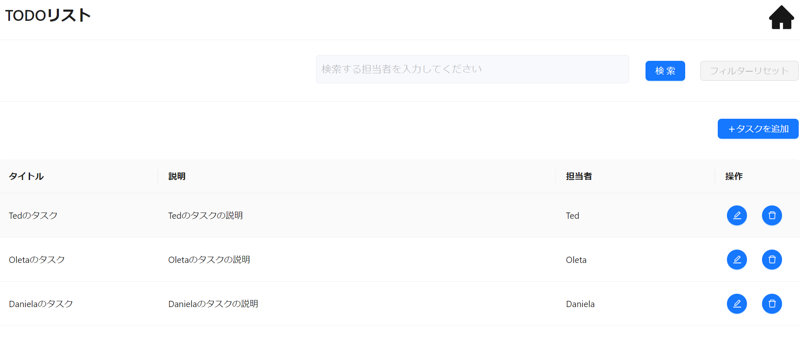

本節を通して、以下の省力化コンポーネントを用いた API 呼び出し方法を理解できます。

- 取得機能
- 登録機能
- 更新機能
- 削除機能
- 検索機能

ここでは[サンプルアプリ](https://github.com/Fintan-contents/dev-react-cs-example/tree/develop)の`todo/page.tsx`、`todo/page.view.ts`、`todo/TodoXxxModal.tsx`ファイルを使用します。

`todo/page.tsx`は CRUD 機能を実装したデモ画面を表示するファイル、`todo/page.view.ts`では View 定義を行うファイル、
`todo/TodoXxxModal.tsx`は登録・更新・削除機能を実装したコンポーネントのファイルとして使用します。

:::info
本節では各機能の API 呼び出し方法にフォーカスして説明します。API 呼び出し方法を含めた一通りの画面実装を行いたい場合は、[画面を作る](../../category/登録画面を作る)を参照してください。
:::

:::info
本節では Orval（拡張版）を使用した実装例を提供しています。
:::
