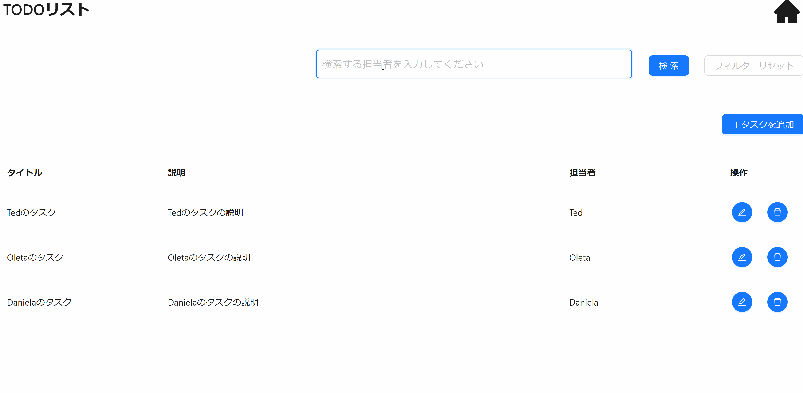

本節では以下に示すような検索機能の実装方法について説明します。



## イベントの型を定義する

検索機能のイベントの型定義には`CsQueryButtonClickEvent`を指定します。

検索用の View（`TodoSearchView`）のプロパティにイベントの型を定義します。型パラメータには検索 API のレスポンスの型を指定します。

```ts title="src/app/todo/page.view.ts"
// Orvalで自動生成されたListTodoResponseの型定義をimport

/**
 * 担当者検索用のViewの型定義
 */
export type TodoSearchView = CsView & {
  assignee: CsInputTextItem;
  searchButton: CsQueryButtonClickEvent<ListTodoResponse>;
};
```

## イベントを初期化する

検索用の View（`TodoSearchView`）にイベントの初期化処理を追加します。

検索 API で Event のフックに`useCsRqAdvancedQueryButtonClickEvent`、引数には Orval で自動生成された API フック`useListTodo()`を指定します。

```ts title="src/app/todo/page.view.ts"
// Orvalで自動生成されたAPIフック（useListTodo）をimport

/**
 * 担当者検索用のViewの初期化
 *
 * @param assignee 検索対象の担当者
 * @returns TodoSearchView 担当者検索用のView
 */
export const useTodoSearchView = (assignee: string): TodoSearchView => {
  const assignee = useCsInputTextItem("担当者", useInit(""), stringRule(true, 1, 20), RW.Editable, "検索する担当者を入力してください");
  return useCsView({
    assignee: assignee,
    // highlight-start
    searchButton: useCsRqAdvancedQueryButtonClickEvent(
      useListTodo(
        { assignee_eq: assignee.value ?? "" }, // クエリパラメータを指定
        {
          query: {
            enabled: false, // ボタンがクリックされるまでクエリを実行しない
            refetchOnWindowFocus: false, // ページにフォーカスがあたってもクエリを実行しない
          },
        },
      ),
    ),
    // highlight-end
  });
};
```

## View 定義を呼び出す

[イベントを初期化する](./search-feature.md#イベントを初期化する)で定義した 検索用の View 定義を呼び出します。

```tsx title="src/app/todo/page.tsx"
const todoSearchView = useTodoSearchView(); // 検索用のViewの呼び出し
```

## ボタンを配置する

検索ボタンを配置する際は、画面コンポーネントとして `AxQueryButton` を使用します。（型定義で用いた `CsQueryButtonClickEvent` に対応した画面コンポーネントを使用します。）

`event`という Props に、対応するイベントの変数を指定します。また、`validationViews` に View の変数を指定することで、バリデーションが実行できます。
レスポンスの値取得には、イベントの `response` メソッドを使用します。

```tsx title="src/app/todo/page.tsx"
// 検索結果取得
const [searchResult, setSearchResult] = useState<ListTodoResponse>();

<AxQueryButton
  type="primary"
  event={todoSearchView.searchButton}
  validationViews={[todoSearchView]}
  onBeforeApiCall={() => {
    todoSearchView.validationEvent?.resetError();
  }}
  onAfterApiCallSuccess={() => {
    setIsFilter(true);
    // レスポンスの値を状態変数に格納
    setSearchResult(todoSearchView.searchButton.response);
  }}
  addClassNames={["vertical-center"]}
>
  検索
</AxQueryButton>;
```

以上で、検索機能の実装が完了します。ボタン押下時に適切に検索 API が呼び出されているかを確認してください。
