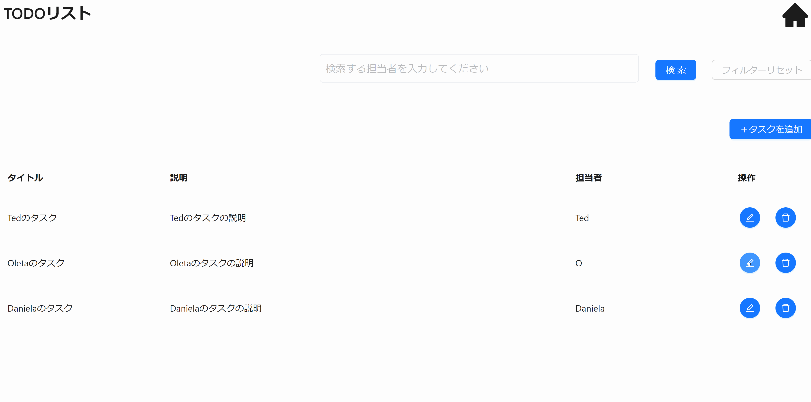

本節では以下に示すような更新機能の実装方法について説明します。



## イベントの型を定義する

更新機能のイベントの型定義には`CsMutateButtonClickEvent`を指定します。

更新用の View（`TodoEditView`）のプロパティにイベントの型を定義します。型パラメータには 更新 API のリクエスト、レスポンスの型を指定します。

```ts title="src/app/todo/page.view.ts"
// Orvalで自動生成されたTodoRegistrationの型定義をimport

/**
 * 更新用のView
 */
export type TodoEditView = CsView & {
  title: CsInputTextItem;
  description: CsTextAreaItem;
  id: CsInputTextItem; // 更新対象を識別するためのID
  // highlight-start
  assignee: CsInputTextItem;
  updateButton: CsMutateButtonClickEvent<
    // 更新対象のId、APIのリクエストデータ型を定義
    {
      todoId: string;
      data: TodoRegistration; // TodoRegistration型を定義
    },
    Todo // APIのレスポンスデータ型を定義
  >;
  // highlight-end
};
```

## イベントを初期化する

更新用の View（`TodoEditView`）にイベントの初期化処理を追加します。

更新 API では Event のフックに`useCsRqAdvancedMutateButtonClickEvent()`、引数には Orval で自動生成された API フック`usePutTodo()`を指定します。

```ts title="src/app/todo/page.view.ts"
// Orvalで自動生成されたAPIフック（usePutTodo）をimport

/**
 * 更新用のViewの初期化
 *
 * @returns TodoEditView 更新用のView
 */
export const useTodoEditView = (): TodoEditView => {
  return useCsView({
    title: useCsInputTextItem(
      "タイトル",
      useInit(""),
      stringRule(true, 1, 20),
      RW.Editable,
      "タイトルを入力してください",
    ),
    description: useCsTextAreaItem(
      "説明",
      useInit(""),
      stringRule(true, 1, 100),
      RW.Editable,
      "タスクの説明を入力してください",
    ),
    assignee: useCsInputTextItem(
      "担当者",
      useInit(""),
      stringRule(true, 1, 20),
      RW.Editable,
      "担当者を入力してください",
    ),
    // 更新対象を識別するためのID（表示はしない）
    id: useCsInputTextItem("ID", useInit(""), stringRule(false)),
    // highlight-start
    updateButton: useCsRqAdvancedMutateButtonClickEvent(usePutTodo()), // イベントの初期化処理の追加
    // highlight-end
  });
};
```

## View 定義を呼び出す

[イベントを初期化する](./update-feature.md#イベントを初期化する)で定義した 更新用の View 定義を呼び出します。

```tsx title="src/app/todo/TodoEditModal.tsx"
const todoEditView = useTodoEditView(); // 更新用のViewの呼び出し
```

## API で取得した値を更新画面の初期値に渡す

固定の文字列などを入力項目の初期値に渡すには`useInit`を指定します。ただし、取得 API のような非同期で取得される値を渡す場合には`setValue`を使用します。

```tsx title="src/app/todo/TodoEditModal.tsx"
// 入力項目に更新対象のデータ（record）の初期値をセット
const setRecord = () => {
  // highlight-start
  todoEditView.id.setValue(record?.id);
  todoEditView.title.setValue(record?.title);
  todoEditView.description.setValue(record?.description);
  todoEditView.assignee.setValue(record?.assignee);
  // highlight-end
};

// モーダルを開いたときにsetRecordを呼ぶ
useEffect(() => {
  setRecord();
  // recordが変更されたら再設定
  // eslint-disable-next-line react-hooks/exhaustive-deps
}, [record]);
```

## ボタンを配置する

更新ボタンを配置する際は、画面コンポーネントとして `AxMutateButton` を使用します。（型定義で用いた `CsMutateButtonClickEvent` に対応した画面コンポーネントを使用します。）

`event` という Props に、対応するイベントの変数を指定します。また、`validationViews` に View の変数を指定することで、バリデーションが実行できます。

```tsx title="src/app/todo/TodoEditModal.tsx"
<Modal
  open={isOpenEditModal}
  title="更新"
  onCancel={onCancel}
  footer={
    <AxMutateButton
      event={todoEditView.updateButton}
      validationViews={[todoEditView]}
      type="primary"
      onAfterApiCallSuccess={onAfterApiCallSuccess}
    >
      更新
    </AxMutateButton>
  }
>
  <>
    <AxInputText item={todoEditView.title}></AxInputText>
    <AxTextArea item={todoEditView.description}></AxTextArea>
    <AxInputText item={todoEditView.assignee}></AxInputText>
  </>
</Modal>
```

## 更新 API に必要なリクエストを設定する

更新 API 呼び出し時に指定する API リクエストを指定します。`todoId`には更新対象の Id、`data`には更新するデータを指定します。

```tsx title="src/app/todo/TodoEditModal.tsx"
const todoEditView = useTodoEditView(); // 更新用のViewの呼び出し

// highlight-start
todoEditView.updateButton.setRequest({
  // リクエストデータに値をセット
  todoId: todoEditView.id.value ?? "",
  data: {
    title: todoEditView.title.value ?? "",
    description: todoEditView.description.value ?? "",
    assignee: todoEditView.assignee.value ?? "",
  },
});
// highlight-end
```

以上で、更新機能の実装が完了します。ボタン押下時に適切に更新 API が呼び出されているかを確認してください。
