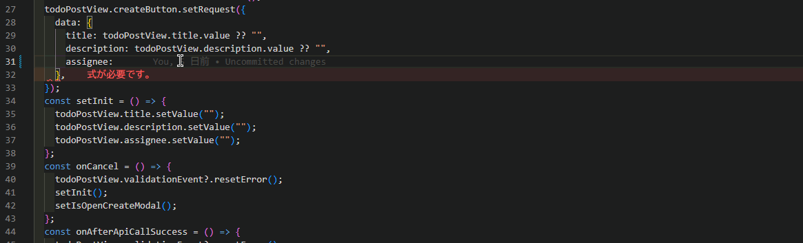

## 対応するイベントやバリデーションは一つの View に定義しましょう

バリデーション、 `AxTableLayout` の自動レイアウトや `isLoading` などの処理は View の単位で処理されます。そのため対応するフィールドごとに View を定義する必要があります。

以下に悪い実装例、良い実装例を示します。<br />

### ❌ 対応する Event と Item を別々の View で定義しない

```tsx
// ItemのみのViewを定義
export type InputTodoView = CsView & {
  title: CsInputTextItem;
  description: CsTextAreaItem;
  assignee: CsInputTextItem;
};

// EventのみのViewを定義
export type TodoCreateView = CsView & {
  createButton: CsMutateButtonClickEvent<
    {
      data: TodoRegistration; // titleやdescription,assigneeのプロパティをもつ型
    },
    Todo
  >;
};
```

### ✅ 対応するフィールドでひとつの View を定義する

```tsx
export type TodoCreateView = CsView & {
  title: CsInputTextItem;
  description: CsTextAreaItem;
  assignee: CsInputTextItem;
  createButton: CsMutateButtonClickEvent<
    {
      data: TodoRegistration; // titleやdescription,assigneeのプロパティをもつ型
    },
    Todo
  >;
};
```

また、対応する Item のコードを自動補完によって直感的に記述することができるメリットがあります。


