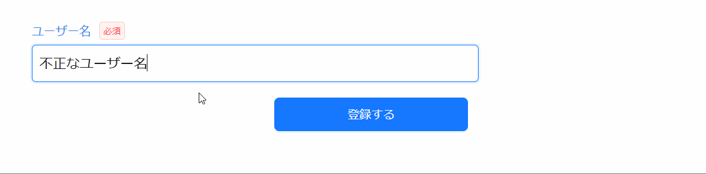

入力項目に任意のタイミングでエラーメッセージを表示したい場合、 Item が持つ `setValidationMessage` を使用します。`setValidationMessage` にメッセージ（文字列）を指定して呼び出すと、対応する入力項目の下部にエラーメッセージが表示されます。また、フォームにはエラー時のスタイルが適用されます。

例えば、サーバーサイドでバリデーションを実施し、その結果を画面で表示したい場合にこの方法が有効です。  
コード例と動作イメージを以下に示します。

```tsx title="サーバーサイドバリデーションの結果を項目下部に表示する"
const view = useRegisterUserView();
return (
  <>
    {/* 入力項目を配置する */}
    <AxInputText item={view.userName} />

    {/* 登録ボタンを配置する */}
    <AxMutateButton
      type="primary"
      event={view.registerButton}
      onCallApiError={(e) => {
        // 本来はイベント変数 e からエラーメッセージを取り出す
        const errorMessage = "サーバーサイドで精査エラーがありました。";
        // highlight-start
        if (errorMessage && view.userName.setValidationMessage) {
          view.userName.setValidationMessage(errorMessage);
        }
        // highlight-end
      }}
    >
      登録する
    </AxMutateButton>
  </>
);
```


