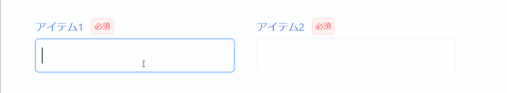

入力コントロールに対するイベント（入力値の変更、フォーカスイン、フォーカスアウト、クリックなど）に応じて何らかの処理を実施したい場合、省力化コンポーネントの `antdProps` にイベントハンドラを指定します。  
`antdProps` は、省力化コンポーネントの内部で使用されている Ant Design の部品に Props を渡すために用意されています。（同様に、 Material UI の場合は `muiProps` 、 React Bootstrap の場合は `bsProps` が使用できます。）

```tsx
<AxInputText
  item={view.item}
  antdProps={{
    // 内部のInputに渡すpropsを指定する
    onChange: (e) => {
      // 入力値が変更された時に実施したい処理を記述する
    },
    onBlur: (e) => {
      // 入力コントロールからフォーカスが外れた時に実施したい処理を記述する
    },
    // ...
  }}
/>
```

例として、「ある項目の入力コントロールからフォーカスが外れたときに、そのとき入力されている値を別の項目にも入力する」場合の実装は、以下のようになります。

```tsx
<AxInputText
  item={view.item1}
  // highlight-start
  antdProps={{
    onBlur: () => view.item2.setValue(view.item1.value),
  }}
  // highlight-end
/>
<AxInputText item={view.item2} />
```

- フォーカスが外れた時に処理を実施したいので、 `onBlur` を使用します。
- Item が持つ `setValue` メソッドを使うことで、対応する入力項目の値を、引数で渡した値に更新できます。


