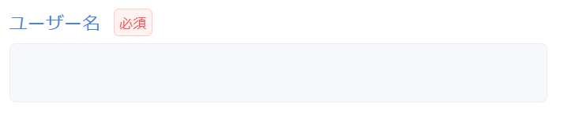
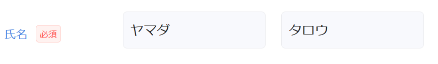
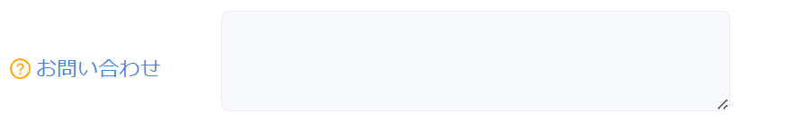

省力化コンポーネントは、1 つの画面用コンポーネントを配置することでラベルとフォームを両方表示できます。

```tsx
// 入力項目の定義
userName: useCsInputTextItem(
  "ユーザー名", // ラベルの指定
  useInit(""),
  stringRule(true, 3, 30, "nameRule"),
),

// 画面用コンポーネント1つでラベルとフォームを表示できる
<AxInputText item={view.userName} />
```



ただし、`AxLabelWithTag` コンポーネントを使用することで、ラベルを単体で表示できます。  
以下のように記述した場合、上記画像のラベル部分のみを再現できます。

```tsx
<AxLabelWithTag label="ユーザー名" required />
```

`AxLabelWithTag` の用途としては主に以下の 2 つがあります。

- 複数フォームに対して 1 つのラベルをつける
- 装飾したラベルをつける

## 複数フォームに対して 1 つのラベルをつける

`AxLabelWithTag` コンポーネントを使うことで、まとまりのある複数フォームに対して 1 つのラベルをつけることができます。「名前」や「電話番号」といった、フォームが複数に分かれる項目に対して有効です。

:::warning
`AxLabelWithTag` を使用する場合は、フォームに対応する部品（例では `AxInputText` ）の `hideLabel` を `true` に設定する必要があります。
:::

```tsx
<Row>
  <Col span={3} style={{ display: "flex", alignItems: "center" }}>
    // highlight-next-line
    <AxLabelWithTag label="氏名" required />
  </Col>
  <Col span={4}>
    <AxInputText hideLabel item={view.userLastName} />
  </Col>
  <Col span={4}>
    <AxInputText hideLabel item={view.userFirstName} />
  </Col>
</Row>
```



## 装飾したラベルをつける

`AxLabelWithTag` の `label` props は、文字列だけでなく `ReactNode` も受け取ることができます。従って、ラベルにアイコンや画像をつけられます。

```tsx
<Row>
  <Col span={3} style={{ display: "flex", alignItems: "center" }}>
    // highlight-start
    <AxLabelWithTag
      label={
        // ReactNodeが渡せる
        <>
          <QuestionCircleOutlined style={{ color: "orange" }} /> お問い合わせ
        </>
      }
      required={false}
      showRequiredTag="none"
    />
    // highlight-end
  </Col>
  <Col span={8}>
    <AxTextArea hideLabel item={view.freeText} />
  </Col>
</Row>
```


