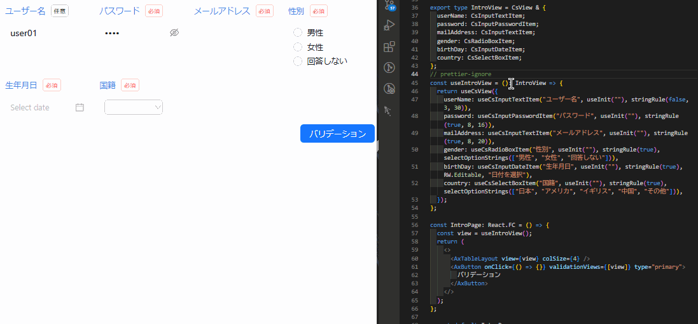
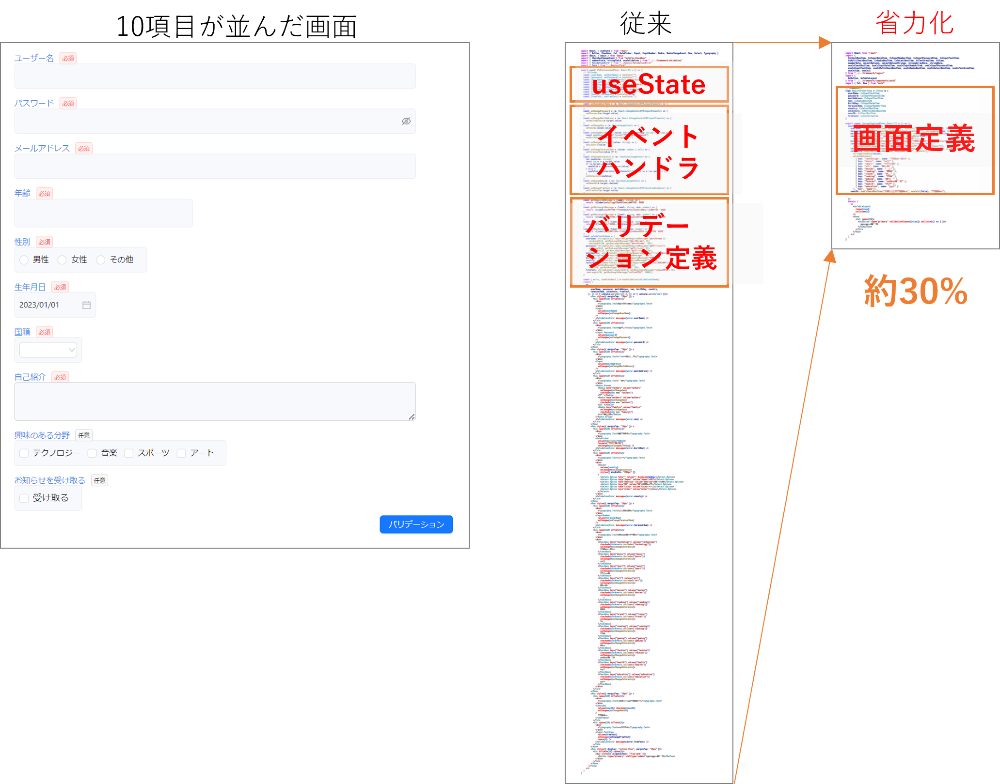

# はじめに

本ドキュメントでは、React で画面開発を行う際の生産性とメンテナンス性を向上させる<strong>省力化コンポーネント</strong>（ライブラリ名：<strong> spa-view-item </strong>）について解説します。

## 省力化コンポーネントとは？

省力化コンポーネントは、従来の React 開発におけるコードの冗長さを排除し、開発効率を向上させるための強力なライブラリです。

上のデモは、省力化コンポーネントが備える次の特徴を示すものです。

- <strong>入力項目の定義が 1~2 行で書ける </strong>
  - 入力項目の定義に関連する情報が 1 箇所に集約されているので、 1~2 行のコードを記述するだけで新たな入力項目を追加できます。
- <strong>バリデーションの定義が簡潔に書ける </strong>
  - ルールをパラメータとして渡すだけでバリデーションが定義できます。
- <strong>高機能なボタンが使える </strong>
  - API 呼び出しやバリデーション実行などの主要な機能を搭載したボタンが提供されているため、パラメータを渡すだけでそれらの機能を実現できます。
- <strong>自動レイアウト機能が使える </strong>
  - 1 つの画面内の複数のコンポーネントを自動で配置できます。

:::info
省力化コンポーネントの特徴について詳しく知りたい場合は[特徴](./know-cs-component/features.md)を参照してください。
:::

上記のような特徴を持つ省力化コンポーネントを用いた場合、従来手法の<strong> 約 30% ～ 40%</strong>のコード量で同様の画面を実装できます。省力化コンポーネントを使用することで、冗長なコードを排除し、開発生産性を向上させることが可能となります。 
また、共通のコンポーネントを使用しているため、メンテナンス性の高いコードベースを維持することも可能となります。

:::info
10 項目が並んだ画面を開発する場合、従来の React 開発で実装を行った場合のコード量は約 300 行ほどになりますが、省力化コンポーネントを用いた場合(かつ自動レイアウトも適用した場合)、約 100 行ほどで実装できます。

:::

本ドキュメントを読み進めていくことで、省力化コンポーネントの概要やプロジェクトへの導入方法、実装方法について理解することができるでしょう。
