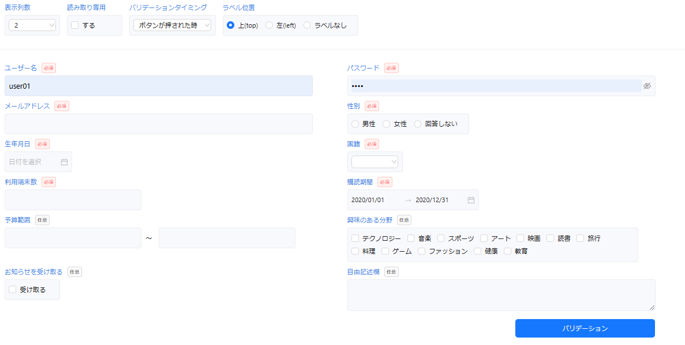

:::warning
デモ画面を含めるかの選択で「いいえ」を選択した方はこの作業を実施する必要がありません。
:::

プロジェクトのルートディレクトリに移動し、次のコマンドを実行してください。

```bash title="Terminal"
npm run dev
```

http://localhost:3000/demo にアクセスし、以下のような画面が表示されれば成功です。



:::info
上記のデモ画面は、UI コンポーネントライブラリに 「Ant Design」 を選択した場合のイメージ図です。
:::

:::warning
デモ画面の中で、省力化コンポーネント部品の import 元が正しく設定されていない可能性があります。以下のファイルの import 文を確認し、エラーが出ている場合は正しいパスに設定し直してください。

- `app/demo/DemoXxxHeader.tsx` (Xxx は選択した UI コンポーネントライブラリ名)
- `app/demo/DemoXxxMain.tsx`
  :::
