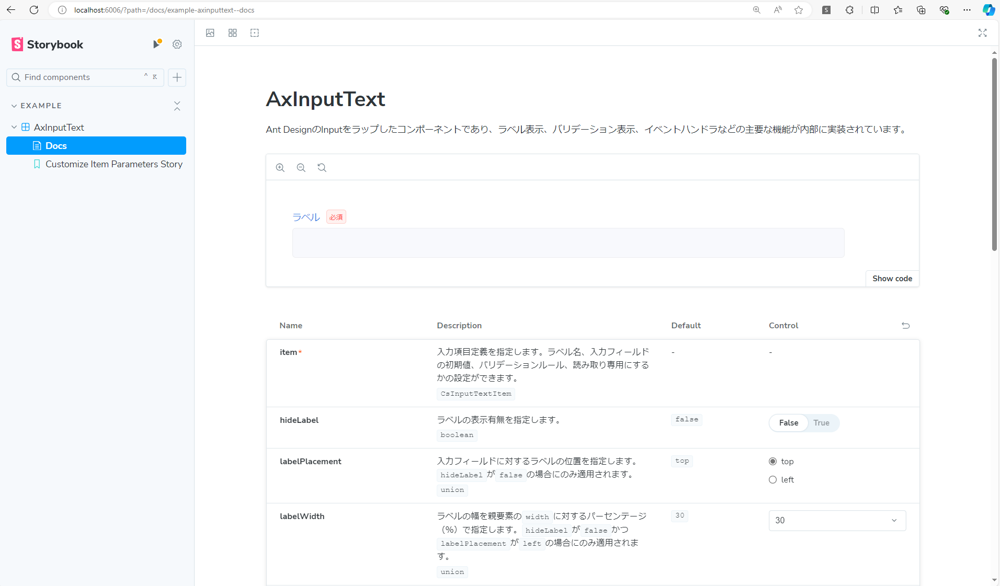

:::warning
Storybook を含めるかの選択で「いいえ」を選択した方はこの作業を実施する必要がありません。
:::

プロジェクトのルートディレクトリに移動し、次のコマンドを実行してください。

```bash title="Terminal"
npm run storybook
```

http://localhost:6006/ にアクセスし、以下のような画面が表示されれば成功です。



:::info
上記の Storybook は、UI コンポーネントライブラリに 「Ant Design」 を選択した場合のイメージ図です。  
Storybook の詳しい使い方については、[Storybook の公式サイト](https://storybook.js.org/docs/get-started/browse-stories)を参照してください。
:::
